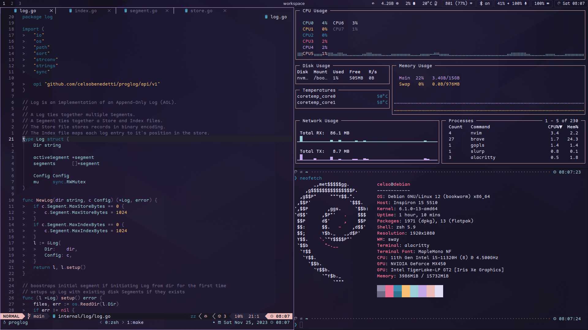

# ~/.dotfiles

<samp><b>Celso's Linux config files</b></samp>

- Terminal centric workflow with [tmux](https://github.com/tmux/tmux) and [neovim](https://github.com/neovim/neovim) .
- Managed with symlinks through [GNU stow](https://www.gnu.org/software/stow/)
- Installed with [Ansible](https://github.com/celsobenedetti/debian-ansible/blob/main/tasks/dotfiles.yml) on a fresh machine

