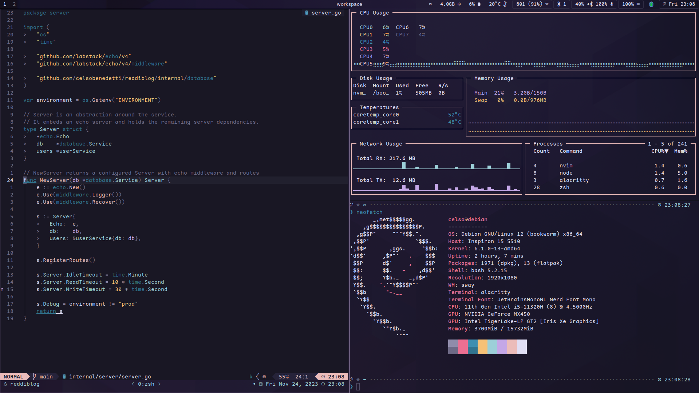

# Config files handled with GNU stow

- [Alacritty](https://github.com/alacritty/alacritty)
- [tmux](https://github.com/tmux/tmux)
- [Neovim](https://github.com/neovim/neovim)
- [zsh](https://www.zsh.org/)
- [zk](https://github.com/mickael-menu/zk)

